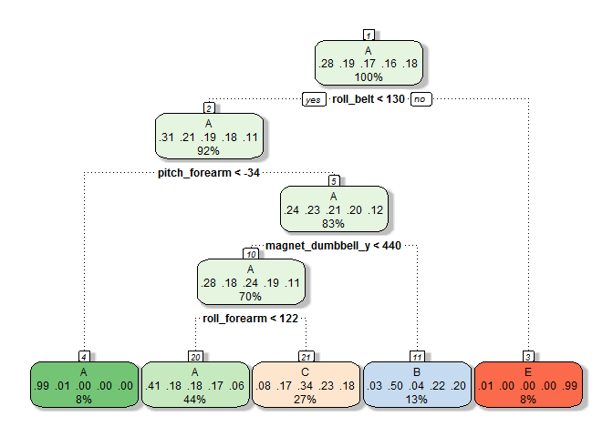

# Exercise Manner Prediction Assignment
Yu Ye  
2016-09-10  


## 1. Overview
One thing that people regularly do is quantify how much of a particular activity they do, but they rarely quantify how well they do it. In this project, my goal is to use data from accelerometers on the belt, forearm, arm, and dumbell of 6 participants to predict the manner in which they did the exercise.

## 2. Loading Data


```r
if (! file.exists("./project")) {dir.create("./project")}
trainUrl <- "https://d396qusza40orc.cloudfront.net/predmachlearn/pml-training.csv"
download.file(trainUrl, destfile = "./project/pml_training.csv")
pmltrain = read.csv("./project/pml_training.csv")
testUrl <- "https://d396qusza40orc.cloudfront.net/predmachlearn/pml-testing.csv"
download.file(testUrl, destfile = "./project/pml_testing.csv")
pmltest = read.csv("./project/pml_testing.csv")
```

## 3. Preprocessing Data
After loading data into R, some preprocess are implemented to pick variables that will be used in prediction models.

```r
library(caret)
dim(pmltrain)
```

```
## [1] 19622   160
```

```r
#Removing the first 5 columns which record observation number, user name and timestamp.
#These are not reasonable covariates for exercise classification.
pmltrain <- pmltrain[,-(1:5)]
#Removing zero covariates
pmltrain <- pmltrain[,-nearZeroVar(pmltrain)]
#Select the variables with percentage of NA values no more than a threshold.
NAthreshold = 0.9
naSelect <- apply(pmltrain, 2, function(x, a = NAthreshold) mean(is.na(x)) < a)
pmltrain <- pmltrain[,naSelect]
#Check no existance of NA.
sum(is.na(pmltrain))
```

```
## [1] 0
```

```r
ncol(pmltrain)
```

```
## [1] 54
```

```r
pmltrain$classe <- as.factor(pmltrain$classe)
```

* 53 VAriables are left to be chosen as predictors after preprocessing.

* Then the training set is randomly splited into a training set and a test set for cross validation.


```r
set.seed(123)
inTrain = createDataPartition(pmltrain$classe, p = 3/4)[[1]]
training = pmltrain[inTrain,]
testing = pmltrain[-inTrain,]
```

## 4. Fitting Models

* Here we try decision tree, random forest, and boosted trees to fit the data.

### 4.1 Decision Tree Predictors

```r
dtFit <- train(classe~.,data=training, method="rpart")
library(rattle)
library(rpart.plot)
fancyRpartPlot(dtFit$finalModel, sub = "")
```

<!-- -->

```r
dtPred <- predict(dtFit,testing)
dtAc <- confusionMatrix(testing$classe, dtPred)
dtAc
```

```
## Confusion Matrix and Statistics
## 
##           Reference
## Prediction    A    B    C    D    E
##          A 1262   20  107    0    6
##          B  378  312  259    0    0
##          C  418   26  411    0    0
##          D  356  141  307    0    0
##          E  144  101  248    0  408
## 
## Overall Statistics
##                                           
##                Accuracy : 0.488           
##                  95% CI : (0.4739, 0.5021)
##     No Information Rate : 0.5216          
##     P-Value [Acc > NIR] : 1               
##                                           
##                   Kappa : 0.3307          
##  Mcnemar's Test P-Value : NA              
## 
## Statistics by Class:
## 
##                      Class: A Class: B Class: C Class: D Class: E
## Sensitivity            0.4934  0.52000  0.30856       NA  0.98551
## Specificity            0.9433  0.85200  0.87570   0.8361  0.89020
## Pos Pred Value         0.9047  0.32877  0.48070       NA  0.45283
## Neg Pred Value         0.6307  0.92718  0.77254       NA  0.99850
## Prevalence             0.5216  0.12235  0.27162   0.0000  0.08442
## Detection Rate         0.2573  0.06362  0.08381   0.0000  0.08320
## Detection Prevalence   0.2845  0.19352  0.17435   0.1639  0.18373
## Balanced Accuracy      0.7183  0.68600  0.59213       NA  0.93785
```

### 4.2 Random Forest Predictors

```r
fitControl <-trainControl(method="cv", number=4, allowParallel=T, verbose=F)
rfFit <-train(classe~.,data=training, method="rf", trControl=fitControl, verbose=F)
rfFit
```

```
## Random Forest 
## 
## 14718 samples
##    53 predictor
##     5 classes: 'A', 'B', 'C', 'D', 'E' 
## 
## No pre-processing
## Resampling: Cross-Validated (4 fold) 
## Summary of sample sizes: 11039, 11038, 11039, 11038 
## Resampling results across tuning parameters:
## 
##   mtry  Accuracy   Kappa    
##    2    0.9938850  0.9922643
##   27    0.9963991  0.9954452
##   53    0.9936815  0.9920073
## 
## Accuracy was used to select the optimal model using  the largest value.
## The final value used for the model was mtry = 27.
```

```r
rfPred <- predict(rfFit,testing)
rfAc <- confusionMatrix(testing$classe, rfPred)
rfAc
```

```
## Confusion Matrix and Statistics
## 
##           Reference
## Prediction    A    B    C    D    E
##          A 1395    0    0    0    0
##          B    1  947    1    0    0
##          C    0    1  854    0    0
##          D    0    0    3  801    0
##          E    0    0    0    0  901
## 
## Overall Statistics
##                                           
##                Accuracy : 0.9988          
##                  95% CI : (0.9973, 0.9996)
##     No Information Rate : 0.2847          
##     P-Value [Acc > NIR] : < 2.2e-16       
##                                           
##                   Kappa : 0.9985          
##  Mcnemar's Test P-Value : NA              
## 
## Statistics by Class:
## 
##                      Class: A Class: B Class: C Class: D Class: E
## Sensitivity            0.9993   0.9989   0.9953   1.0000   1.0000
## Specificity            1.0000   0.9995   0.9998   0.9993   1.0000
## Pos Pred Value         1.0000   0.9979   0.9988   0.9963   1.0000
## Neg Pred Value         0.9997   0.9997   0.9990   1.0000   1.0000
## Prevalence             0.2847   0.1933   0.1750   0.1633   0.1837
## Detection Rate         0.2845   0.1931   0.1741   0.1633   0.1837
## Detection Prevalence   0.2845   0.1935   0.1743   0.1639   0.1837
## Balanced Accuracy      0.9996   0.9992   0.9975   0.9996   1.0000
```

* The optimal random forest model uses 27 variables as predictors. 

### 4.3 Boosting Predictors

```r
gbmFit <-train(classe~.,data=training, method="gbm", trControl=fitControl,verbose=F)
gbmFit
```

```
## Stochastic Gradient Boosting 
## 
## 14718 samples
##    53 predictor
##     5 classes: 'A', 'B', 'C', 'D', 'E' 
## 
## No pre-processing
## Resampling: Cross-Validated (4 fold) 
## Summary of sample sizes: 11039, 11039, 11037, 11039 
## Resampling results across tuning parameters:
## 
##   interaction.depth  n.trees  Accuracy   Kappa    
##   1                   50      0.7583909  0.6934824
##   1                  100      0.8297325  0.7844623
##   1                  150      0.8711096  0.8368565
##   2                   50      0.8844270  0.8536129
##   2                  100      0.9375592  0.9210099
##   2                  150      0.9634456  0.9537593
##   3                   50      0.9308325  0.9124513
##   3                  100      0.9726862  0.9654458
##   3                  150      0.9870906  0.9836687
## 
## Tuning parameter 'shrinkage' was held constant at a value of 0.1
## 
## Tuning parameter 'n.minobsinnode' was held constant at a value of 10
## Accuracy was used to select the optimal model using  the largest value.
## The final values used for the model were n.trees = 150,
##  interaction.depth = 3, shrinkage = 0.1 and n.minobsinnode = 10.
```

```r
gbmPred <- predict(gbmFit,testing)
gbmAc <- confusionMatrix(testing$classe, gbmPred)
gbmAc
```

```
## Confusion Matrix and Statistics
## 
##           Reference
## Prediction    A    B    C    D    E
##          A 1395    0    0    0    0
##          B   12  929    7    1    0
##          C    0   10  843    1    1
##          D    0    8   13  781    2
##          E    0    0    1   10  890
## 
## Overall Statistics
##                                           
##                Accuracy : 0.9865          
##                  95% CI : (0.9829, 0.9896)
##     No Information Rate : 0.2869          
##     P-Value [Acc > NIR] : < 2.2e-16       
##                                           
##                   Kappa : 0.983           
##  Mcnemar's Test P-Value : NA              
## 
## Statistics by Class:
## 
##                      Class: A Class: B Class: C Class: D Class: E
## Sensitivity            0.9915   0.9810   0.9757   0.9849   0.9966
## Specificity            1.0000   0.9949   0.9970   0.9944   0.9973
## Pos Pred Value         1.0000   0.9789   0.9860   0.9714   0.9878
## Neg Pred Value         0.9966   0.9954   0.9948   0.9971   0.9993
## Prevalence             0.2869   0.1931   0.1762   0.1617   0.1821
## Detection Rate         0.2845   0.1894   0.1719   0.1593   0.1815
## Detection Prevalence   0.2845   0.1935   0.1743   0.1639   0.1837
## Balanced Accuracy      0.9957   0.9880   0.9864   0.9896   0.9969
```

### 4.4 Accuracy Comparison

```r
library(xtable)
t1 <- data.frame(Decision.Trees = c(dtAc$overall['Accuracy'], 1-dtAc$overall['Accuracy']), Random.Forest = c(rfAc$overall['Accuracy'], 1-rfAc$overall['Accuracy']), Boosted.Trees = c(gbmAc$overall['Accuracy'], 1-gbmAc$overall['Accuracy']), row.names = c("Accuracy", "Estimated Out of Sample Error Rate"))
AcTable <- xtable(t1, caption = "Model Accuracy Comparison", align = c(rep("c", 4)), digits = 4)
print(AcTable, type = "html", caption.placement = "top")
```

<!-- html table generated in R 3.3.1 by xtable 1.8-2 package -->
<!-- Sat Sep 10 17:21:19 2016 -->
<table border=1>
<caption align="top"> Model Accuracy Comparison </caption>
<tr> <th>  </th> <th> Decision.Trees </th> <th> Random.Forest </th> <th> Boosted.Trees </th>  </tr>
  <tr> <td align="center"> Accuracy </td> <td align="center"> 0.4880 </td> <td align="center"> 0.9988 </td> <td align="center"> 0.9865 </td> </tr>
  <tr> <td align="center"> Estimated Out of Sample Error Rate </td> <td align="center"> 0.5120 </td> <td align="center"> 0.0012 </td> <td align="center"> 0.0135 </td> </tr>
   </table>


* Given all above, decision tree results in low accuracy 0.487969, so it's not considered a suitable predicting model for this case.

* Random forest and boosted trees are implemented with 4-folded cross-validated resampling. Both of these two models fit the training data well.

* __Random forest performs the highest accuracy in testing set, the estimated out of sample error rate is 0.12%, so it's chosen as final model to predict the classe of the given official test set.__

## 5. Predicting Official Test Set

```r
library(dplyr)
pmltest <- select(pmltest, match(names(pmltrain[,-54]), names(pmltest)), problem_id)
pml_rfPred <- predict(rfFit, pmltest)
t2 <- matrix(nrow = 1, ncol = 20)
t2 <- as.data.frame(t2)
colnames(t2) <- pmltest$problem_id
t2[1,] <- pml_rfPred
row.names(t2) = "Prediction"
PredTable <- xtable(t2, align = c(rep("c", 21)))
print(PredTable, type = "html")
```

<!-- html table generated in R 3.3.1 by xtable 1.8-2 package -->
<!-- Sat Sep 10 16:33:37 2016 -->
<table border=1>
<tr> <th>  </th> <th> 1 </th> <th> 2 </th> <th> 3 </th> <th> 4 </th> <th> 5 </th> <th> 6 </th> <th> 7 </th> <th> 8 </th> <th> 9 </th> <th> 10 </th> <th> 11 </th> <th> 12 </th> <th> 13 </th> <th> 14 </th> <th> 15 </th> <th> 16 </th> <th> 17 </th> <th> 18 </th> <th> 19 </th> <th> 20 </th>  </tr>
  <tr> <td align="center"> Prediction </td> <td align="center"> B </td> <td align="center"> A </td> <td align="center"> B </td> <td align="center"> A </td> <td align="center"> A </td> <td align="center"> E </td> <td align="center"> D </td> <td align="center"> B </td> <td align="center"> A </td> <td align="center"> A </td> <td align="center"> B </td> <td align="center"> C </td> <td align="center"> B </td> <td align="center"> A </td> <td align="center"> E </td> <td align="center"> E </td> <td align="center"> A </td> <td align="center"> B </td> <td align="center"> B </td> <td align="center"> B </td> </tr>
   </table>

* Through _Course Project Prediction Quiz_, the random forest model is proved to predict all 20 official test samples correctly.
